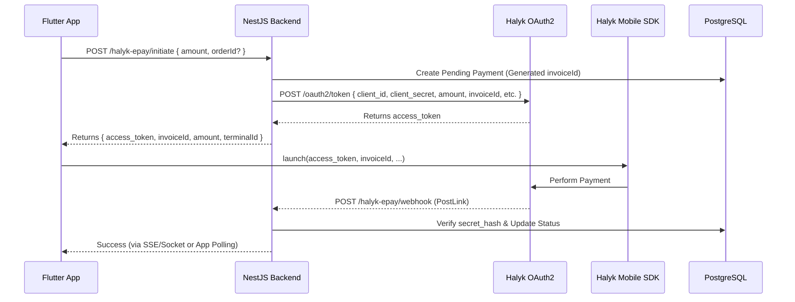

# Halyk Bank EPay Integration Guide (Flutter Mobile App)

This document provides the Low-Level Design (LLD) and integration steps for Halyk Bank EPay (v2) for the `dance_attix` project.

## 1. High-Level Architecture
For a mobile app (Flutter), the security best practice is the **Server-to-Server Token Exchange** model.

1. **Flutter App**: Requests a payment token from the **NestJS Backend**.
2. **NestJS Backend**:
   - Validates the request (user, amount, order).
   - Requests an `access_token` from Halyk's OAuth2 server using `client_id` and `client_secret`.
   - Saves a pending payment record in the database.
   - Returns the `access_token` and `invoiceId` to the Flutter app.
3. **Flutter App**: Launches the Halyk Mobile SDK with the received `access_token`.
4. **Halyk Server**: Sends a **Webhook (PostLink)** to the NestJS Backend once the payment is completed.
5. **NestJS Backend**: Verifies the webhook and updates the user's wallet or order status.

---

## 2. Low-Level Design (LLD)

### A. Data Schema & Entities
We will implement two new entities in `src/halyk-epay/entities/`:

#### 1. `HalykEpayPayment`
Tracks every transaction attempt.
| Field | Type | Description |
| :--- | :--- | :--- |
| `id` | UUID | Primary Key |
| `invoiceId` | String | Unique order number (6-15 digits) |
| `amount` | Decimal | Transaction amount |
| `currency` | String | Default: 'KZT' |
| `userId` | UUID | FK to `User` |
| `orderId` | Number | (Optional) FK to `Order` |
| `status` | Enum | `PENDING`, `SUCCESS`, `FAILED` |
| `secretHash` | String | Unique hash sent/echoed for security |
| `createdAt` | Date | Timestamp |

#### 2. `HalykEpayEvent`
Ensures idempotency for webhooks.
| Field | Type | Description |
| :--- | :--- | :--- |
| `eventId` | String | Unique ID from Halyk Bank |
| `processed` | Boolean | Flag to avoid double processing |

### B. Module Structure
```
src/halyk-epay/
├── dto/
│   ├── initiate-payment.dto.ts
│   └── halyk-webhook.dto.ts
├── entities/
│   ├── halyk-payment.entity.ts
│   └── halyk-event.entity.ts
├── halyk-epay.controller.ts
├── halyk-epay.module.ts
└── halyk-epay.service.ts
```

### C. Sequence Diagram (Data Flow)



---

## 3. Implementation Details

### Step 1: Backend Token Request
The backend must use the following credentials to get a token:
- **Test URL:** `https://test-epay-oauth.epayment.kz/oauth2/token`
- **Prod URL:** `https://epay-oauth.homebank.kz/oauth2/token`

**Payload for Halyk Token:**
```json
{
  "grant_type": "client_credentials",
  "scope": "payment",
  "client_id": "YOUR_CLIENT_ID",
  "client_secret": "YOUR_CLIENT_SECRET",
  "invoiceID": "000000001",
  "amount": 1000,
  "currency": "KZT",
  "terminal": "YOUR_TERMINAL_ID",
  "postLink": "https://api.danceattix.com/halyk-epay/webhook",
  "failurePostLink": "https://api.danceattix.com/halyk-epay/webhook/fail"
}
```

### Step 2: Webhook Verification (Security)
Halyk Bank uses an **"Echo Hash"** mechanism. 
1. When requesting the token, the backend can optionally include a `secret_hash`.
2. Halyk will return this exact `secret_hash` in the webhook.
3. **Validation:** `if (received_hash === db_stored_hash) { process() }`

### Step 3: Handling Success
Upon successful webhook:
1. **Wallet Top-up:** Update `Wallets.balance` and insert into `Transections` table.
2. **Order Payment:** Update `Order.paymentStatus` to `COMPLETED`.
3. **Notifications:** Push to `notifications` Bull queue.

---

## 4. Data Usage Map

| Data Point | Source | Used In | Purpose |
| :--- | :--- | :--- | :--- |
| `amount` | Flutter App | Backend -> Halyk | Defines how much the user pays. |
| `userId` | JWT Token | Backend DB | Links payment to the authenticated user. |
| `invoiceId` | Backend (Gen) | DB & Halyk Request | Unique identifier for Halyk tracking. |
| `access_token`| Halyk API | Flutter SDK | Authorizes the mobile app to show payment UI. |
| `secret_hash` | Backend (Gen) | Webhook Verify | Ensures the webhook is legitimate and untampered. |

---

## 5. Environment Variables Required

```env
HALYK_EPAY_TERMINAL_ID=...
HALYK_EPAY_CLIENT_ID=...
HALYK_EPAY_CLIENT_SECRET=...
HALYK_EPAY_OAUTH_URL=https://test-epay-oauth.epayment.kz/oauth2/token
HALYK_EPAY_WEBHOOK_URL=https://.../halyk-epay/webhook
```
